For this workshop you will need an AWS account and about 60 minutes. 
If if you get stuck, the Connect flows and Lex bot are provided as zipped resources.
Don't forget to remove the resources at the end of the workshop, to avoid unnecessary charges.

# 1. Intro to Amazon Connect

## What are we going to build?
1. A working instance of Connect
2. A voiced IVR flow that will recognize customers calling in based on their phone number, offer personalized greetings and adapt based on user interaction history.

## What services are we going to use?

1. Connect as the Contact Center solution and backbone for the other services
2. A DynamoDB table to store user information 
3. Lambda functions to store and retrieve user information
4. S3 to store conversation data and call metadata
5. Cloudwatch to monitor and debug the solution
6. Polly to voice IVR dialogue
7. Lex for basic chatbot functionality

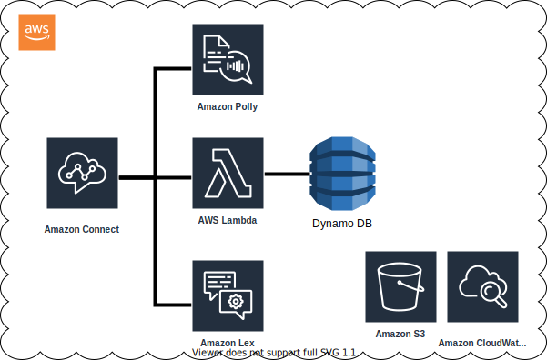

## Prepare the Environment (if not already done)

### Launch an Amazon Connect instance
1. Log into the console.
2. Navigate to the Amazon Connect service page.
3. Select Add an instance
4. For identity management, choose Store users within Amazon Connect and enter a unique url to serve as an access point for your Contact center. Click Next.
   1. For production applications, it may make more sense to integrate with an existing directory, but for the purposes of today, let's use the built in user management capabilities.
5. For Create an Administrator page, add an admin identity.  You can use your IAM user to authenticate as an admin into the instance if you do not create a separate entity. Click Next.
6. For Telephony Options, make sure both incoming and outbound calls are selected. Click Next.
7. For Data storage, leave the default settings. Click Next.
8. Review and Create the instance.
9. Once the instance is created, select Get Started.


# 2. Getting Started with Amazon Connect

1. Access the instance.
   1. Navigate to the Amazon Connect access URL
   2. Connect with the Username and Password for the admin account.
2. Once you&#39;ve entered the Amazon Connect application, select &quot;Let&#39;s go&quot;.
3. Claim your phone number. The country should be the same as where your billing address is. Select Direct Dial number and click Next.


4. Wait a minute or so.  
5. Give yourself a call! Amazon Connect comes with a number of example contact flows to demonstrate different functionalities.
(Optional) Choose 1 > 1 > 1 in the IVR to get transfered to an agent and make the web client ring!


# 3. Create your first Contact Flow

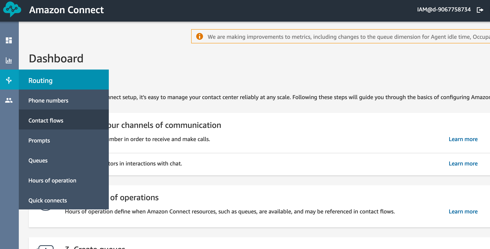

1. Under Routing, select Contact Flows.
2. Select create contact flow.
3. Enter the name TransferToQueue.
4. Under Interact, add a Play prompt module and link it to Entry point.
5. Click into the module, select Text to speech and enter the text &quot;I&#39;m putting you in the queue&quot;.
6. Under Set, add a Set working queue module and link it to the Play prompt module.
7. Click into the module and select the BasicQueue.


8. Under Terminate/Transfer add a Transfer to Queue module and link it to the Success option of the Set working queue module.
9. Add two more Play prompt modules. Make one say &quot;Something went wrong. Try again later&quot; and the other &quot;I&#39;m sorry. It seems our queue is at capacity. Try again later&quot;.
10. Link the error message to the Error options on set working queue, Transfer to Queue, and the at capacity message.
11. Under Terminate/Transfer, add a Disconnect/Hang up module and link your final messages to it.
12. Save and then publish.
13. Under Routing > Phone numbers, select the number you&#39;ve claimed.

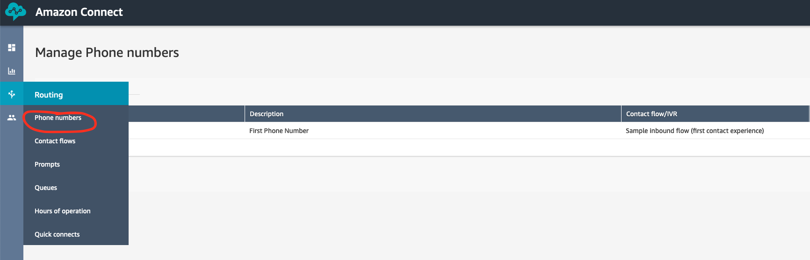

14. Under Contact flow / IVR, select the TransferToQueue contact flow you just created and save.

### Test it out!

15. Open up the CCP by clicking the phone icon in the upper right hand corner.


16. Wait a few moments and give yourself a call.
17. Notice that when a customer is put into a queue, they are really put into the Default customer queue.  If you want to change the experience, you can.  You can also build things like interruptible queue flows.  Similarly, the agent (you) heard the Default agent whisper.  Whispers are used to share information to only one side of the conversation.


# 4. Building a personalized greeting - Integrating AWS Lambda and DynamoDB

We will use a DynamoDB table to store our name and telephone number. For every call, a Lambda function will lookup the calling number in the table and, if found, will return the name. We will use Polly to greet the caller by name.  


### 4.1 Creating the DynamoDB table

1. Log into the Amazon console.
2. Navigate to Services > DynamoDB
3. Click 'Create Table'. Name the table "customers" and use a "phone" field as the primary key.

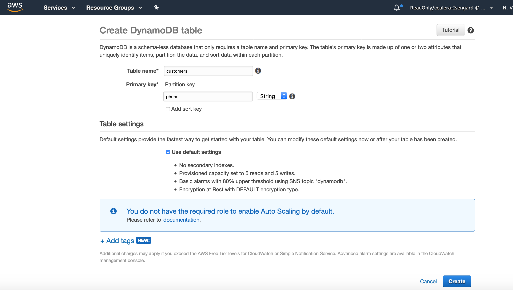

4. Click Create.

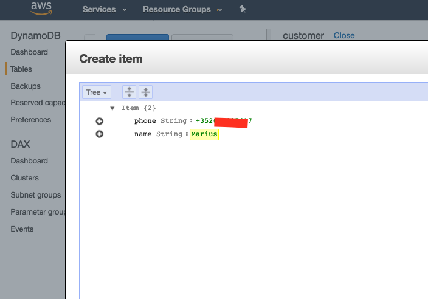

5. Create a new item. Add your phone number and a "name" field of String type. Fill in your name.
The phone number should contain the country code (e.g. +352691997777)

### 4.2 Creating an IAM role used by Lambda to access DynamoDB

1. Log into the Amazon console.
2. Navigate to Services > IAM > Roles
3. Click Create Role
4. Choose AWS Service as the type of trusted entity and Lambda as the use case. 
5. Click Next: Permissions
6. Search for and select AmazonDynamoDBFullAccess. Click Next.
7. Enter a name (e.g. "ConnectDDBLambdaRole") and click Create Role.


### 4.3 Creating the getCustomer Lambda

1. Log into the Amazon console.
2. Navigate to Services > Lambda
3. Click Create Function. If you have never used Lambda, you will get a slightly different get started screen - in this case, select Author from scratch.
4. Enter a name. Select Python 3.7 as the runtime. For permissions, use an existing role and select the role you created during the previous step. Click Create.
5. Navigate to the Function Code section and paste the following code:

```python
import boto3

def lambda_handler(event, context):

    dynamodb = boto3.resource('dynamodb')

    table = dynamodb.Table('customers')

    response = table.get_item(Key={'phone':event['Details']['ContactData']['CustomerEndpoint']['Address']})

    return response['Item']
```
6. Click Save.


### 4.4 Granting permissions for Lambda in Connect

1. Log into the Amazon console.
2. Navigate to Services > Amazon Connect. Select your Connect instance.
3. Select Contact Flows
4. Scroll down to the Lambda section and add the getCustomer function you just created. Make sure to click +Add Lambda Function!


### 4.5 Update the flow

1. Log into the Connect dashboard.
2. Navigate to Routing > Flows and open TransferToQueue
3. Under Set, find the Set Logging Behavior block and insert it right after the Start block.
4. Under Integrate, find the Invoke AWS Lambda Function block and insert it after the Logging Behavior block. Click the block and select the getCustomers Lambda and increase the timeout to 8 seconds. If you cannot see the Lambda, make sure you granted the correct permissions as instructed in the previous section.

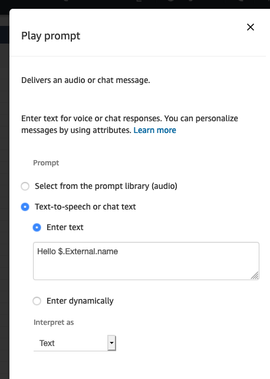

5. Add another Play block after the Invoke Lambda block. In the Text to speech section add "Hello $.External.name". Link the success endpoint of the Lambda block to the new Play block. Link the error endpoint to the following Play block.

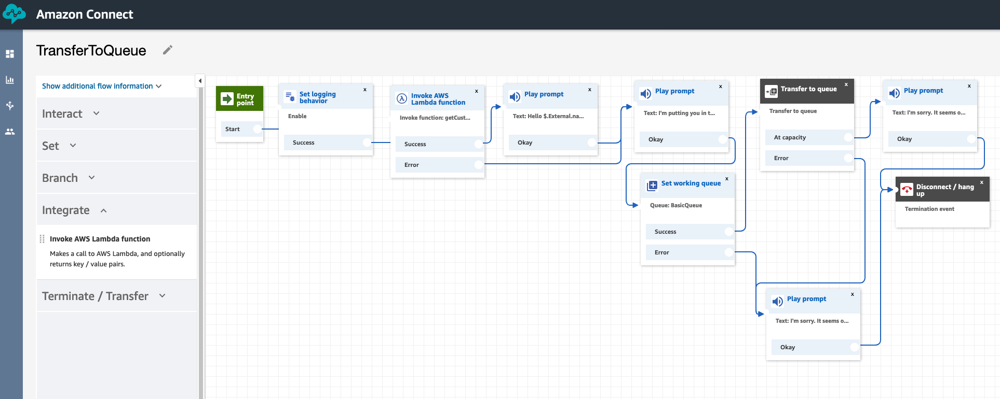

6. Click Publish.
7. Wait a couple of minutes and give yourself another call. You should now be greeted by name!.
8. If you do not receive the greeting, you can troubleshoot your flow using CloudWatch logs. To access the logs, navigate to Services > CloudWatch > Logs > Log Groups > (aws/connect/(yourConnectInstanceName).


# 5. More personalization - Store user interactions

In this section we will use a Lambda to update the DynamoDB table we created previously with a choice the user makes in the IVR. We will use this information on subsequent calls to add another layer of personalization to our greeting.


### 5.1 Creating the updateCustomer Lambda

1. Perform the same steps as for the getCustomer function, but use this code:

```python
import boto3

def lambda_handler(event, context):

    dynamodb = boto3.resource('dynamodb')
    
    intent = event['Details']['Parameters']['intent']

    table = dynamodb.Table('customers')
    
    if intent: table.update_item(
    Key={
        'phone': event['Details']['ContactData']['CustomerEndpoint']['Address']
    },
    UpdateExpression='SET lastIntent = :val1',
    ExpressionAttributeValues={
        ':val1': intent
    }
)

    response = table.get_item(Key={'phone':event['Details']['ContactData']['CustomerEndpoint']['Address']})

    return response['Item']
```

2. Save the function and add the necessary permissions in Connect (see 4.4).


### 5.2 Update the flow to store user interactions

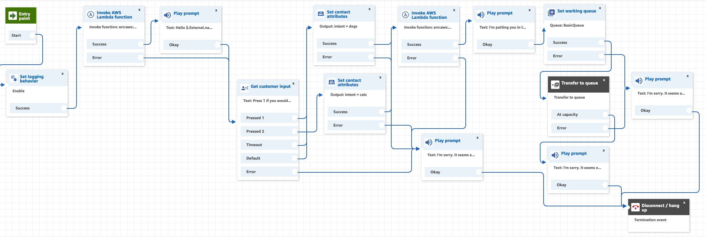

1. Open the TransferToQueue flow.
2. From the Interact section, add a Get Customer Input block. Add two options, Dogs and Cats.

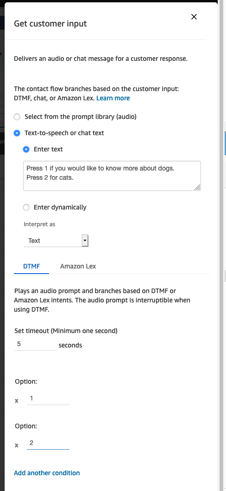

3. From the Set section, add two Set Contact Attributes blocks. Set the Destination key for both as 'intent'. For value, use 'dogs' for one block and 'cats' for the other.
3. From the Integrate block, add a Integrate Lambda block. Select the updateCustomer Lambda. For function input parameters select 'Use Attribute' and select Destination key: intent, Type: User Defined, Attribute: intent.

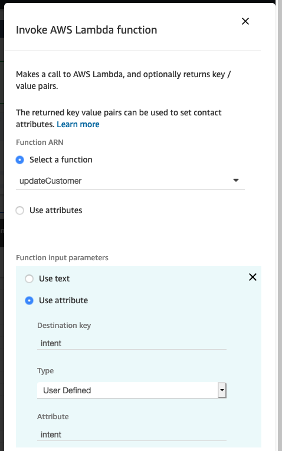

4. Link the blocks as shown below and Publish the flow.
5. Wait for a couple of minutes and call in to test the new options. After making a selection, the DynamoDB should contain the last customer intent.You can monitor the 'customers' table in DynamoDB (Services > DynamoDB > Tables > customers > Items.

### 5.3 Update the flow to include the previous interactions 

### (Option 1 - shorter)

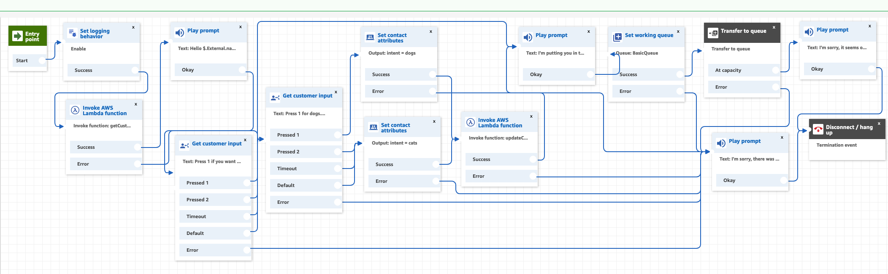

1. Open the TransferToQueue flow.
2. Edit the greetings Play block. The new message should say 'Hello $.External.name. The last time you called, it was about $.External.lastIntent'

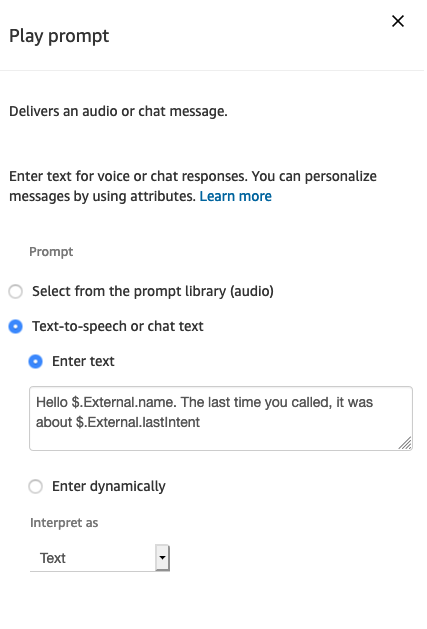

3. Add another Get Customer Input block from the Interact section. This will ask the customer if he/she whishes to change the previous selection or make a new one. If the customer wants to change the selection, route to the dogs/cats selection. If not, route to queue.
4. Link the blocks as showin in the image.
5. Publish the flow, wait a couple of minutes and call in to test it.

### (Option 2 - longer, handles no 'lastIntent')

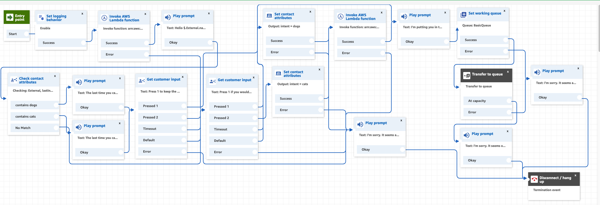

1. Open the TransferToQueue flow.
2. From the Branch section, select the Check contact Attributes block. Check the 'lastIntent' external attribute with two conditions: contains 'dogs' and contains 'cats'.

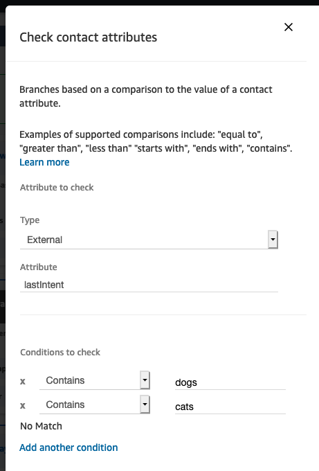

3. Add two play prompts for the 2 cases: cats or dogs. The prompts could say: 'The last time you called, it was about cats/dogs'.
4. Add another Get Customer Input block from the Interact section. This will ask the customer if he/she whishes to change the previous selection or make a new one. If the customer wants to change the selection, route to the dogs/cats selection. If not, route to queue.
5. Link the blocks as showin in the image.
6. Publish the flow, wait a couple of minutes and call in to test it.

# 6. Using Amazon Lex as a Conversational Router

In this section we will create a simple Lex box to replace the DTMF choices (press 1 for X, press 2 for Y ..) in the IVR. Instead, the user will be able use his voice to make a selection. The bot will understand a few simple intents: 'cats', 'dogs', 'yes' and 'no'.

### 6.1 Build the Lex bot

1. Open the AWS Console and navigate to Services > Amazon Lex
2. Click Create > custom bot. Give it a name, select Joanna as the voice, set 2 min timeout and select 'no' for sentinemt analisys and COPPA notice.
3. Add a new Intent. Name it 'cats' and add a few sample utterences. Click Save Intent.


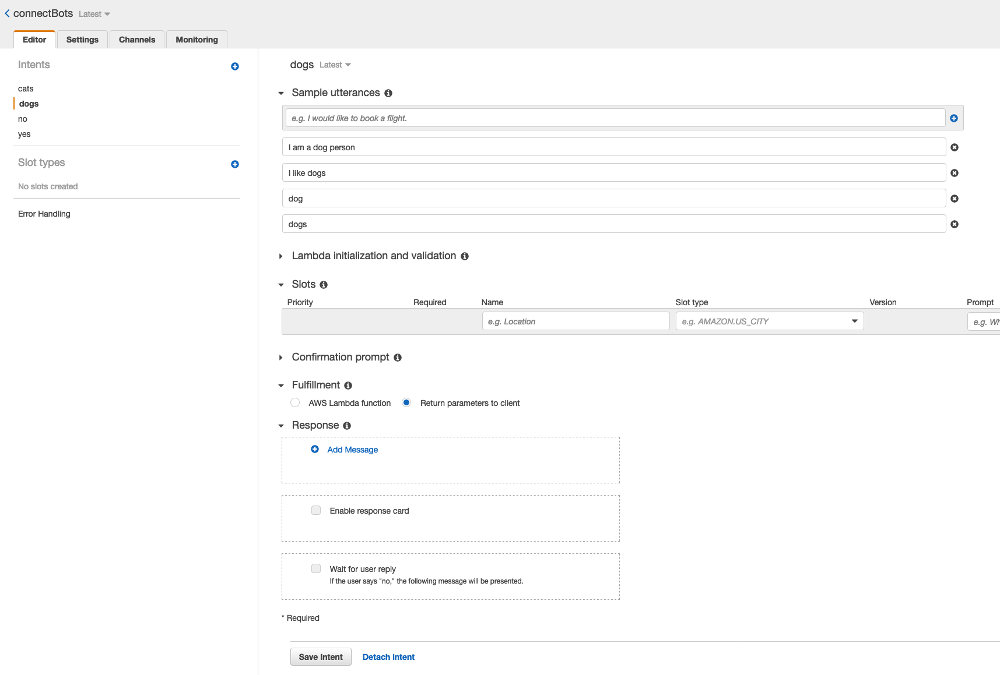

4. Add a similar intents for 'dogs', 'yes' and 'no'.
5. Click Build and wait a few seconds.
6. Click Publish. Input an alias and click Publish.

### 6.2 Grant the necessary permissions in Connect

1. Open the AWS Console and navigate to Services > Amazon Connect
2. Select your Connect instance and navigate to Contact Flows
3. In the Lex section, search for your bot and select + Add Lex bot

### 6.3 Update the flow

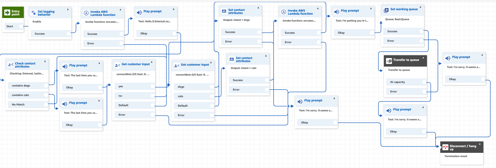

1. Navigate to the Connect console and open the TransferToQueue flow
2. Click on the dogs/cats customer input block. Change the prompt to 'Would like to know more about dogs or are you a cats person ?'. Choose Amazon Lex instead of DTMF. Select the bot you created and add two intents: 'dogs' and 'cats'. Click save.
Link the dogs/cats endpoints to their respective Set Attribute blocks.

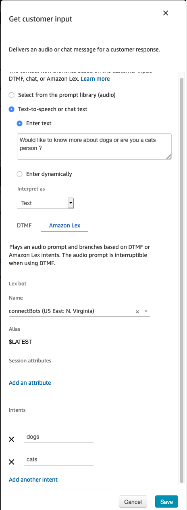

3. Similarly, update the yes/no customer input block to use the same bot, but the yes/no intents.
4. Publish the flow, wait a couple of minutes and call it to test the updates.

# 7. Clean-up

1. Log into the Amazon console.
2. Navigate to Services > Amazon Connect. 
3. Click on the checkbox next to your Connect instance and click Remove.
4. Navigate to Services > DynamoDB > Tables.
5. Click on the checkbox next to your customers table and click Delete.
6. Navigate to Services > Lambda.
7. Click on the checkbox next to your get/updateCustomer functions and click Actions > Delete.
8. Navigate Services > S3.
9. Find the bucket created by Connect (default name looks like 'connect-9535c3748467'). Delete call recordings, if any.
